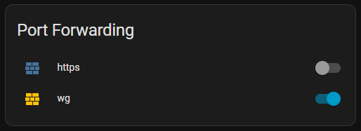

# Speedport PFW Card

[](https://hacs.xyz)
[](https://github.com/drylith/speedport-pfw-card/releases/latest)

A Lovelace dashboard card for [Home Assistant](https://www.home-assistant.io/) that displays all port forwarding rules from the [Speedport v2 integration](https://github.com/drylith/speedport-v2) in a clean, compact card — including toggle switches to enable or disable rules directly from the dashboard.



## Requirements

- [Speedport v2 integration](https://github.com/drylith/speedport-v2) installed and configured
- Home Assistant with HACS

## Installation

**Method 1 – HACS (recommended)**

1. HACS → Frontend → ⋮ → Custom repositories
2. Add `https://github.com/drylith/speedport-pfw-card` → Category: **Lovelace**
3. Install **Speedport PFW Card**
4. Reload browser cache (Shift+F5)

**Method 2 – Manual**

1. Copy `pfw-card.js` to `config/www/pfw-card.js`
2. Settings → Dashboards → Resources → Add resource:
   - URL: `/local/pfw-card.js`
   - Type: JavaScript module
3. Reload browser cache

## Usage

Add the card to your dashboard via the UI or manually in YAML:

```yaml
type: custom:pfw-card
```

The card automatically picks up all `switch.speedport_pfw_*` entities — no further configuration needed. New port forwarding rules appear after reloading the integration.

## Features

- Lists all port forwarding rules dynamically
- Toggle rules on/off directly from the card
- Icon color reflects active/inactive state
- No configuration required

## Related

- [Speedport v2 Integration](https://github.com/drylith/speedport-v2) — the underlying HACS integration this card is built for
